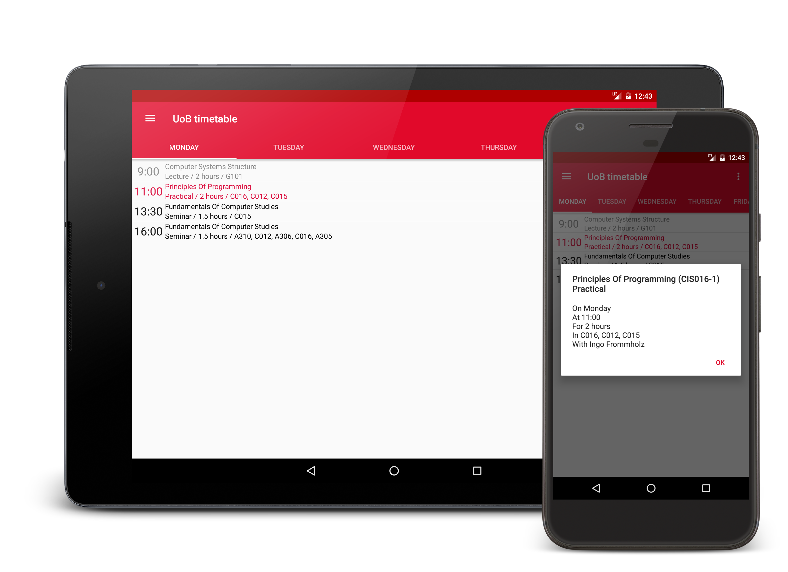

# UoB timetable

This application displays the 5-day timetable for any University of Bedfordshire 
course.

## Features

- Detailed information for each session including the unit, time, rooms and 
staff members
- Session hiding
- Term dates
- Offline support

## Builds

See releases tab

## Changelog

- 2.3 (14)
	- Cached sessions now loaded if download fails
	- Improved empty session list UI
- 2.2 (13)
	- Improved settings UI
	- Fixed Term Date app shortcut bugs
- 2.1 (12)
	- Fixed crash when session list fails to download
	- Added progress bar for term dates
- 2.0 (11)
	- Complete rewrite with Material Design
	- Landscape support
- 1.0

## Dev Notes

- Minimum API 15 (4.0.3)
- Enable debug view in settings by tapping the bottom of the view 7 times

## License

[GPL v3](license.md)
